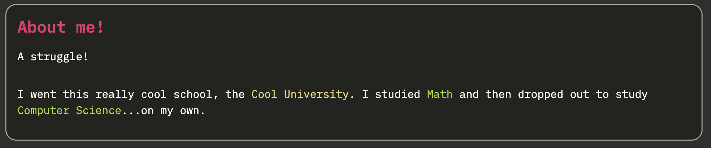
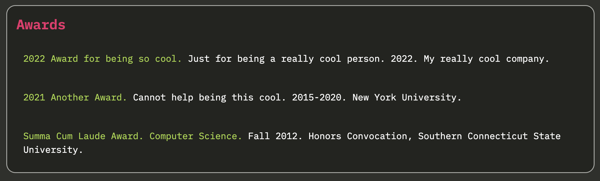
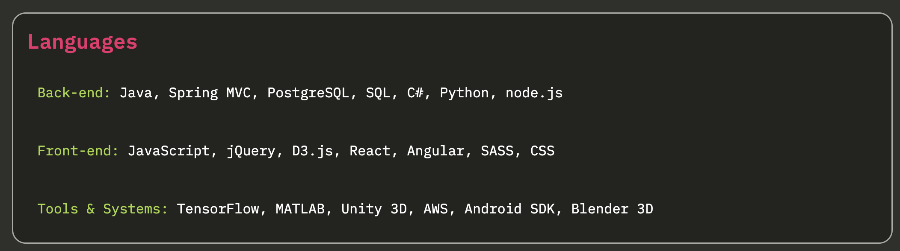
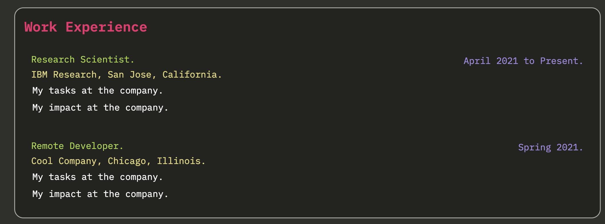
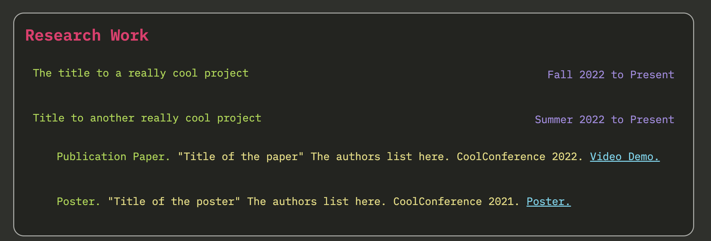

# Personal Website Template: Monokai Theme

How do I make my personal website look like the default Sublime code editor?

Look no further, and clone this repo! 


Install [http-server](https://www.npmjs.com/package/http-server):

```
npm install --global http-server
```

And then in this directory, run:
```
http-server
```

# Components

## Navigation Bar
The navigation bar appears at the top. You may edit the `index.html` to fit it as you need.

```
<div class="nav">
    <div class="name">Your name here</div>
    <div id="myLinks">
        <div class="button" onclick="setPage('partial/aboutme.html',0)">About Me</div>
        <div class="button" onclick="setPage('partial/cv.html',1)">CV</div>
    </div>
    <a href="javascript:void(0);" class="menu-icon" onclick="onClickMenu()">
        <i class="fa fa-bars"></i>
    </a>
</div>
```

Important! Be sure to set the number appropriately in `setPage('partial/aboutme.html',0)`. The number indicates its place in the navigation bar, e.g. 
- the `aboutme.html` is the 0'th link and 
- the `cv.html` is the 1st link.

You can set the homepage by editing whatever is in the script tags. This sets the:

```
$(document).ready(function(){
    setPage("partial/cv.html",1);
});
```


## Header, Personal Info

Edit the `index.html` where the div is `class="header"`:

``` 
<div class="header">
    <div class="name">Your name here</div>
    <div class="tabbed">
        <p class="content-text">NYC, USA // San Jose, USA</p>
        <p class="content-text">your.email@email.com</p>
        <p class="content-text"><a href="https://github.com/theTrueCaptian/">My Github</a> // <a href="https://maeda-han.medium.com/">My Medium Articles</a></p>
    </div>
</div>
```

The different classes dictate the different styles:
- `class="name"` makes the text pink color and larger

- `class="content-text"` makes the text white color and smaller

## Box

A box is an individual box with a white outline.



It is a div with `class="resume-row"`:

``` 
<div class="resume-row">
    <div class="resume-col-header">About me!</div>
    <div class="resume-col-content ">
        <div class="paragraph">
            A struggle!
        </div>
        <div class="paragraph">
            I went this really cool school, the <span class="location">Cool University</span>.
            I studied <span class="highlight">Math </span>and then dropped out to study <span class="highlight">Computer Science</span>...on my own.
        </div>
    </div>
</div>
```

A `resume-row` contains a `resume-col-header` and a `resume-col-content` that marks the header of the box and the content of the box. 
You may customize the content and put whatever you want in the `resume-col-content`.

You can also highlight text and color location texts with appropriate classes.  


## Simple List




If you like a simple list in a box, like a list of awards or a list of talks, use the `list` class inside the `resume-col-content` and within the `list` class, have a list of `list-items`:

``` 
<div class="list">
     <div class="list-item">
        <span class="header">2022 Award for being so cool. </span>
        <span class="description">
        Just for being a really cool person.
        </span>
        <span class="date">2022.</span>
        <span class="location">My really cool company.</span>
     </div>
        <div class="list-item">
        <span class="header">2021 Another Award. </span>
        <span class="description">
        Cannot help being this cool.
        </span>
        <span class="date">2015-2020.</span>
        <span class="location">New York University.</span>
     </div>
     <div class="list-item">
        <span class="header">Summa Cum Laude Award. Computer Science.</span>
        <span class="description"></span>
        <span class="date">Fall 2012.</span>
        <span class="location">Honors Convocation, Southern Connecticut State University.</span>                
     </div>
</div>  
```

You can even do something simpler within each `list-item`:



``` 
<div class="list-item">
    <span class="header">Back-end: </span>
    <span class="description">Java, Spring MVC, PostgreSQL, SQL, C#, Python, node.js</span>          
</div>
```


## List of Publications

If you'd like to list publications or talks, it is recommended to also use a `list` with `list-item`s. 
Within that `list-item` use a `publication-item` class:

``` 

<div class="resume-row">
   <div class="resume-col-header">Talks</div>
   <div class="resume-col-content">
      <div class="list">
	  <div class="publication-item">
              <span class="title">How to give really cool presentations.</span>
              <span class="date">Fall 2022.</span>
              <span class="location">Remote, Rensselaer Polytechnic Institute, Communications Course.</span>
              <span class="links">
              </span>
          </div>
          <div class="publication-item">
              <span class="title">Another talk about communication.</span>
              <span class="date">Spring 2022.</span>
              <span class="location">Remote, University of California, Santa Cruz, Communications Course.</span>
              <span class="links">
              </span>
          </div>
      </div>

   </div>
</div>
```

## Dated Experience

If you want to list your work or schools along with some dates on the side, you have to customize the `resume-col-content`.



Inside the `resume-col-content`, for each item of experience, you would create a `content-text-box`:

``` 
<div class="content-text-box">
    <div class="header">Research Scientist.</div>
    <div class="date">April 2021 to Present.</div>
    <div class="location">IBM Research, San Jose, California.</div>
    <div class="description">
        <p>My tasks at the company.</p>
        <p>My impact at the company.</p>
    </div>
    <div class="links"></div>
</div>
```

## Complex Boxes with Dates and Tabbed List

Suppose you want a list of dated experiences, and within each one of those, you want a list that is indented:


Each dated experience is a `content-text-box` and within that you add a div with `class="list tabbed"`. 
This renders a list where then you can add `list-item`'s in. 

```

<div class="resume-row">
    <div class="resume-col-header">Research Work</div>
    <div class="resume-col-content">
        <div class="content-text-box">
            <div class="header">The title to a really cool project </div>
            <div class="date">Fall 2022 to Present</div>
            <div class="description">
            </div>
        </div>
        <div class="content-text-box">
            <div class="header">Title to another really cool project </div>
            <div class="date">Summer 2022 to Present</div>
            <div class="description">

                <div class="list tabbed">
                    <div class="publication-item">
                        <span class="header">Publication Paper.</span>
                        <span class="title">
                         "Title of the paper" The authors list here. CoolConference 2022.
                     </span>
                        <span class="links">
                            <a href="youtube.com">Video Demo.</a>
                     </span>
                    </div>
                    <div class="publication-item">
                        <span class="header">Poster.</span>
                        <span class="title">
                         "Title of the poster" The authors list here. CoolConference 2021.
                     </span>
                        <span class="links">
                            <a href="drive.com">Poster.</a>
                     </span>
                    </div>
                </div>
            </div>
        </div>
    </div>
</div>
 
```


# To develop compile

```
sass css/index.scss css/sublime.monokai.css

```

Or

```
sass --watch css/index.scss css/sublime.monokai.css

``