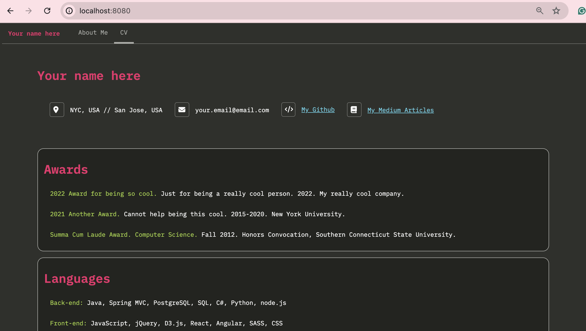

# Personal Website Template: Monokai Theme

How do I make my personal website look like the default Sublime code editor?

Look no further, and clone this repo! 





Install [http-server](https://www.npmjs.com/package/http-server):

```
npm install --global http-server
```

And then in this directory, run:
```
http-server
```


